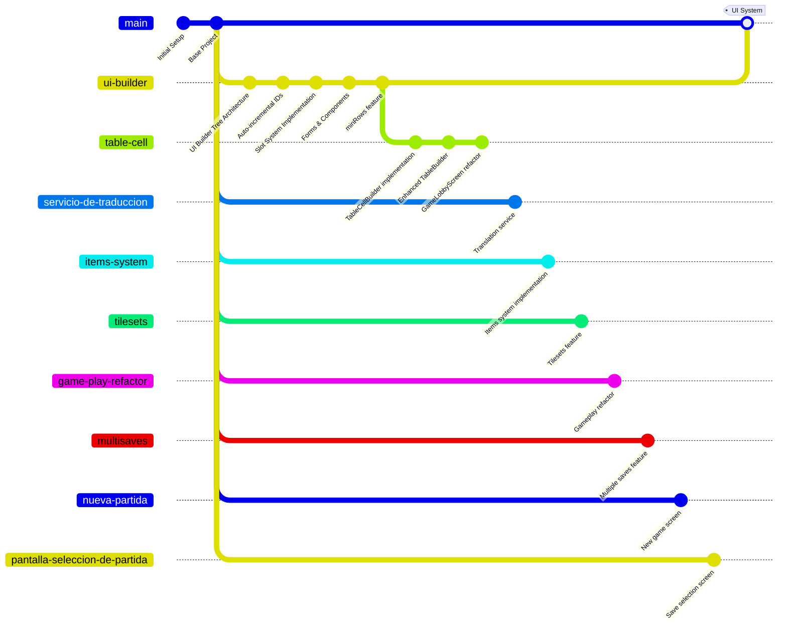

# Diagrama de Ramas - GameCore

## Estructura de Ramas del Proyecto

### Ramas Locales Activas
- **main** (rama principal - default)
- **table-cell** (rama actual)
- **ui-builder**
- **servicio-de-traduccion**

### Ramas Remotas en origin



## Descripción de Ramas

### 🎯 Ramas Principales

#### **main**
- Rama principal de producción
- Contiene código estable y probado

#### **table-cell** ⭐ (ACTUAL)
- Implementación de TableCellBuilder
- Mejoras en TableBuilder y TableRowBuilder
- Auto-fill functionality para tablas
- Refactorización de GameLobbyScreenService

#### **ui-builder**
- Sistema de construcción de UI con arquitectura de árbol
- Sistema de slots implementado
- Componentes: Input, Select, Checkbox, Label, Button
- IDs auto-incrementales contextuales
- Gestión de contenedores y formularios

#### **servicio-de-traduccion**
- Servicio de traducción/internacionalización
- Sistema i18n

### 🚀 Ramas de Features (Remotas)

#### **items-system**
- Sistema de items del juego
- Gestión de inventario

#### **tilesets**
- Sistema de tilesets
- Gestión de sprites y terrenos

#### **game-play-refactor**
- Refactorización del sistema de gameplay
- Mejoras en la lógica del juego

#### **multisaves**
- Sistema de múltiples partidas guardadas
- Gestión de saves

#### **nueva-partida** / **pantalla-seleccion-de-partida**
- Pantallas de gestión de partidas
- UI para nueva partida y selección

#### **sound-fake-resource**
- Sistema de recursos de audio
- Gestión de sonidos

### 🛠️ Ramas de Desarrollo/Debug

#### **better-spa-structure**
- Mejoras en la estructura SPA (Single Page Application)

#### **debug-ide** / **ide** / **feature/ide-helper-setup**
- Configuración de herramientas de desarrollo
- IDE helpers para mejor experiencia de desarrollo

#### **implement-debug-endpoints**
- Endpoints de debugging
- Herramientas de desarrollo

#### **some-optimizations-1**
- Optimizaciones varias del sistema

#### **sample-1**
- Rama de pruebas/ejemplos

## Relación entre Ramas

```
main (producción)
├── ui-builder (base de UI components)
│   └── table-cell (extensión de tablas) ⭐ ACTUAL
├── servicio-de-traduccion (i18n)
├── items-system (sistema de items)
├── tilesets (sistema de sprites)
├── game-play-refactor (lógica del juego)
├── multisaves (gestión de partidas)
├── nueva-partida (UI partidas)
├── pantalla-seleccion-de-partida (UI selección)
├── better-spa-structure (arquitectura)
├── debug-ide (herramientas dev)
└── sound-fake-resource (audio)
```

## Estado Actual

**Rama Activa:** `table-cell`

**Última Actividad:**
- Refactorización de GameLobbyScreenService
- Implementación de TableCellBuilder
- Mejoras en manejo de headers y botones de acción
- Auto-fill functionality para celdas de tabla

**Ramas Base:**
- `main`: Rama principal estable
- `ui-builder`: Base del sistema UI (556d831)
- `table-cell`: Desarrollo actual de componentes de tabla (6929cd0)

## Notas

- La rama `table-cell` se basa en `ui-builder`
- `ui-builder` contiene el sistema de slots y componentes base
- Múltiples ramas de features independientes desde `main`
- Sistema modular permite desarrollo en paralelo

---

**Fecha de generación:** 20 de octubre de 2025  
**Repository:** GameCore (eormeno)
