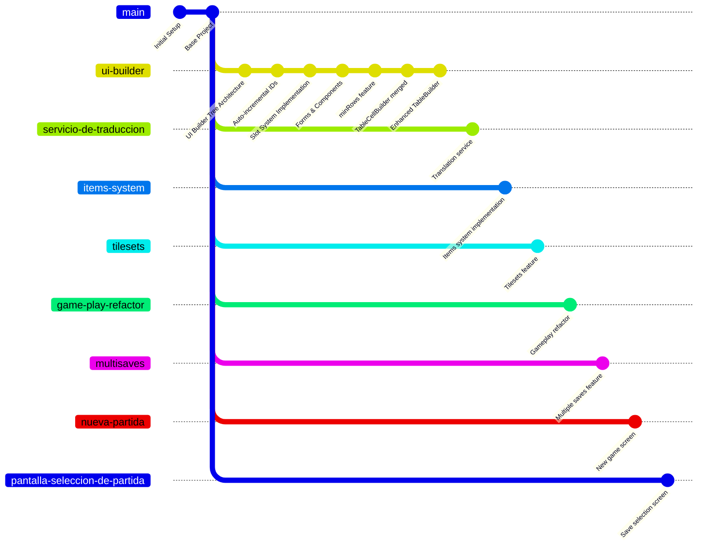

# Diagrama de Ramas - GameCore

## Estructura de Ramas del Proyecto

### Ramas Locales Activas
- **main** (rama principal - default)
- **ui-builder** (rama actual) ⭐
- **servicio-de-traduccion**

### Ramas Remotas en origin



## Descripción de Ramas

### 🎯 Ramas Principales

#### **main**
- Rama principal de producción
- Contiene código estable y probado

#### **ui-builder** ⭐ (ACTUAL)
- Sistema de construcción de UI con arquitectura de árbol
- Sistema de slots implementado
- Componentes completos: Input, Select, Checkbox, Label, Button, Table, TableRow, TableCell, TableHeaderRow, TableHeaderCell
- IDs auto-incrementales contextuales
- Gestión de contenedores y formularios
- **Integraciones recientes:**
  - **table-header (2025-10-20):** Sistema completo de headers para tablas
    - TableHeaderCellBuilder y TableHeaderRowBuilder
    - Refactorización del sistema de headers con IDs auto-incrementales
    - Tests unitarios y documentación completa
  - **table-cell (2025-10-20):** Sistema de celdas para tablas
    - TableCellBuilder con auto-fill functionality
    - Mejoras en TableBuilder y TableRowBuilder
    - Refactorización de GameLobbyScreenService
    - Enum Align para alineación de contenido

#### **servicio-de-traduccion**
- Servicio de traducción/internacionalización
- Sistema i18n

### 🚀 Ramas de Features (Remotas)

#### **items-system**
- Sistema de items del juego
- Gestión de inventario

#### **tilesets**
- Sistema de tilesets
- Gestión de sprites y terrenos

#### **game-play-refactor**
- Refactorización del sistema de gameplay
- Mejoras en la lógica del juego

#### **multisaves**
- Sistema de múltiples partidas guardadas
- Gestión de saves

#### **nueva-partida** / **pantalla-seleccion-de-partida**
- Pantallas de gestión de partidas
- UI para nueva partida y selección

#### **sound-fake-resource**
- Sistema de recursos de audio
- Gestión de sonidos

### 🛠️ Ramas de Desarrollo/Debug

#### **better-spa-structure**
- Mejoras en la estructura SPA (Single Page Application)

#### **debug-ide** / **ide** / **feature/ide-helper-setup**
- Configuración de herramientas de desarrollo
- IDE helpers para mejor experiencia de desarrollo

#### **implement-debug-endpoints**
- Endpoints de debugging
- Herramientas de desarrollo

#### **some-optimizations-1**
- Optimizaciones varias del sistema

#### **sample-1**
- Rama de pruebas/ejemplos

## Relación entre Ramas

```
main (producción)
├── ui-builder (sistema completo de UI) ⭐ ACTUAL
├── servicio-de-traduccion (i18n)
├── items-system (sistema de items)
├── tilesets (sistema de sprites)
├── game-play-refactor (lógica del juego)
├── multisaves (gestión de partidas)
├── nueva-partida (UI partidas)
├── pantalla-seleccion-de-partida (UI selección)
├── better-spa-structure (arquitectura)
├── debug-ide (herramientas dev)
└── sound-fake-resource (audio)
```

## Estado Actual

**Rama Activa:** `ui-builder` ⭐

**Última Actividad:**
- ✅ Merge exitoso de `table-header` en `ui-builder` (ddfcd56)
- ✅ Sistema completo de headers para tablas
- ✅ TableHeaderCellBuilder y TableHeaderRowBuilder implementados
- ✅ Refactorización del sistema de headers con IDs auto-incrementales
- ✅ Tests unitarios completos (193 líneas)
- ✅ Documentación exhaustiva (318 líneas)
- ✅ Rama `table-header` eliminada (local y remota)

**Ramas Base:**
- `main`: Rama principal estable
- `ui-builder`: Sistema UI completo con componentes de tabla y headers integrados (ddfcd56)

## Notas

- ✅ `table-header` fue mergeada exitosamente en `ui-builder` y eliminada
- ✅ `table-cell` fue mergeada exitosamente en `ui-builder` y eliminada
- `ui-builder` contiene el sistema completo de UI con todos los componentes de tabla
- Sistema de tablas completo: TableBuilder, TableRowBuilder, TableCellBuilder, TableHeaderRowBuilder, TableHeaderCellBuilder
- Múltiples ramas de features independientes desde `main`
- Sistema modular permite desarrollo en paralelo

## Historial de Merges

| Fecha | Merge | Descripción |
|-------|-------|-------------|
| 2025-10-20 | `table-header` → `ui-builder` | TableHeaderCellBuilder, TableHeaderRowBuilder, sistema de headers refactorizado |
| 2025-10-20 | `table-cell` → `ui-builder` | TableCellBuilder, mejoras en TableBuilder/TableRowBuilder, Enum Align |

---

**Fecha de actualización:** 20 de octubre de 2025  
**Repository:** GameCore (eormeno)  
**Última acción:** Merge y eliminación de rama `table-header`  
**Componentes de tabla completados:** ✅ Table, TableRow, TableCell, TableHeaderRow, TableHeaderCell
