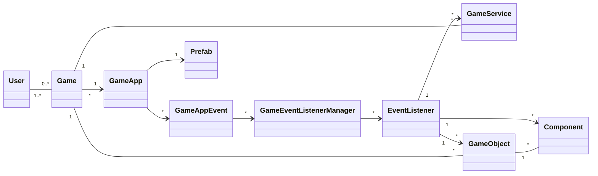

El siguiente diagrama de clases describe los elementos más importantes del dominio del framework:

Estoy trabajando en un framework para backend de videojuegos. Lo estoy implementando en Laravel, con Eloquent.
> Nota: En este documento cuando se dice que un elemento es persistente, se está diciendo que sus instancias se almacenan en un registro de una base de datos.
### GameObject
Los GameObjects son objetos persistentes asociados a una partida de un juego. Pueden organizarse en estructuras de árbol al definir relaciones padre-hijo entre ellos.
El comportamiento de cada GameObject se define en Components, también persistentes, y con instancias únicas para cada GameObject.
Cada GameObject puede definir un conjunto de estados con un componente asociado a cada uno de ellos. Si bien estos Components son esencialmente iguales a los otros Components, reciben el nombre de "State Components", dado que son gestionados por el GameObject, en función del único estado actual que éste mantiene. Así, el GameObject va habilitando o deshabilitando en forma automática sus "State Components" conforme va cambiando su estado.
Todo GameObject tiene una vista (la cual puede ser vacía o nula). Esta vista se construye a partir de combinar las vistas definidas en cada Component habilitado.
### Component
Los Components son elementos persistentes asociados a una única instancia de un GameObject. Permiten implementar comportamientos específicos de un GameObject. A su vez, un GameObject puede definir que un Component estará asociado a uno de sus States; en tal caso, el Component pasa a llamarse State Component.
Para implementar comportamiento, la clase Component, define métodos callback, que pueden ser sobreescritos por una clase heredera. Los callbacks más importantes son:
- onStart(): Se ejecuta una sola vez, antes de definir una vista.
- onUpdate(): Se ejecuta en cada TPS (Tick per second).
- view(): Permite retornar una vista en forma de documento JSON.
- onEnter(): Este callback se ejecuta cuando el GameObject "entra" al State Component que tiene asociado.
- onExit(): Este callback se ejecuta cuando el GameObject "sale" del State Component (para ingresar en otro).
Además, los Components:
- Pueden definir sus propios atributos persistentes.
- Pueden estar habilitados o deshabilitados.
- Pueden definir una vista.
### Prefab
Los prefabs son plantillas estáticas que definen una estructura anidada de GameObjects, con sus componentes y atributos.
El objetivo de los Prefabs es facilitar la instanciación de estructuras complejas de GameObjects, sus estados, sus Components y sus atributos, para una partida específica de un juego.
### GameService
Los GameServices son clases de servicio asociados a una partida. Pueden ser o no persistentes. En este último caso, pueden definir sus propios atributos.
