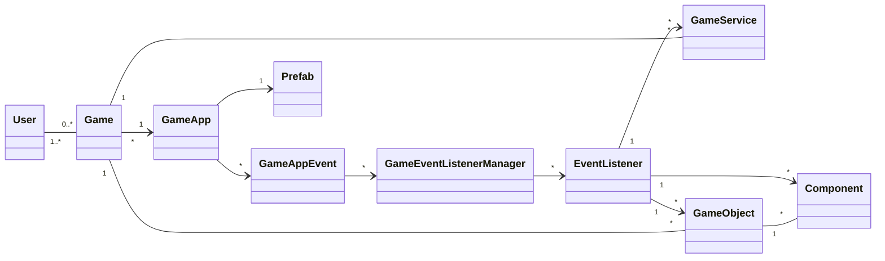

# GameCore Framework
El GameCore Framework es un framework para backend de videojuegos. Está diseñado para facilitar la implementación de la lógica de un juego en el backend, y para permitir la comunicación con el frontend a través de una API REST.
El framework está diseñado para ser utilizado en conjunto con un frontend que se comunique con el backend a través de una API REST. El frontend puede ser implementado en cualquier tecnología, siempre y cuando pueda consumir una API REST.
## Tecnologías
El framework está implementado en PHP, utilizando el framework Laravel. La persistencia de los datos se realiza a través de Eloquent, el ORM de Laravel.
## Elementos del dominio
El dominio del framework está compuesto por los siguientes elementos:
- GameObject
- Component
- Prefab
- GameService
- Event System
- View System
- Render System
- Client protocol
## Diagrama de clases
El siguiente diagrama de clases describe los elementos más importantes del dominio del framework:

> Nota: En este documento cuando se dice que un elemento es persistente, se está diciendo que sus instancias se almacenan en un registro de una base de datos.
### GameObject
Los GameObjects son objetos persistentes asociados a una partida de un juego. Pueden organizarse en estructuras de árbol al definir relaciones padre-hijo entre ellos.
El comportamiento de cada GameObject se define en Components, también persistentes, y con instancias únicas para cada GameObject.
Cada GameObject puede definir un conjunto de estados con un componente asociado a cada uno de ellos. Si bien estos Components son esencialmente iguales a los otros Components, reciben el nombre de "State Components", dado que son gestionados por el GameObject, en función del único estado actual que éste mantiene. Así, el GameObject va habilitando o deshabilitando en forma automática sus "State Components" conforme va cambiando su estado.
Todo GameObject tiene una vista (la cual puede ser vacía o nula). Esta vista se construye a partir de combinar las vistas definidas en cada Component habilitado.
### Component
Los Components son elementos persistentes asociados a una única instancia de un GameObject. Permiten implementar comportamientos específicos de un GameObject. A su vez, un GameObject puede definir que un Component estará asociado a uno de sus States; en tal caso, el Component pasa a llamarse State Component.
Para implementar comportamiento, la clase Component, define métodos callback, que pueden ser sobreescritos por una clase heredera. Los callbacks más importantes son:
- onStart(): Se ejecuta una sola vez, antes de definir una vista.
- onUpdate(): Se ejecuta en cada TPS (Tick per second).
- view(): Permite retornar una vista en forma de documento JSON.
- onEnter(): Este callback se ejecuta cuando el GameObject "entra" al State Component que tiene asociado.
- onExit(): Este callback se ejecuta cuando el GameObject "sale" del State Component (para ingresar en otro).
Además, los Components:
- Pueden definir sus propios atributos persistentes.
- Pueden estar habilitados o deshabilitados.
- Pueden definir una vista.
### Prefab
Los prefabs son plantillas estáticas que definen una estructura anidada de GameObjects, con sus componentes y atributos.
El objetivo de los Prefabs es facilitar la instanciación de estructuras complejas de GameObjects, sus estados, sus Components y sus atributos, para una partida específica de un juego.
### GameService
Los GameServices son clases de servicio asociados a una partida. Pueden ser o no persistentes. En este último caso, pueden definir sus propios atributos.
### Event System
El Event System es un sistema de eventos que permite la comunicación entre los distintos elementos del dominio. Los eventos son mensajes que se envían entre los elementos del dominio, y que pueden ser escuchados por otros elementos. Los principales elementos del Event System son:

- EventListener: un objeto que escucha eventos específicos y ejecuta una acción en respuesta a ellos. Los EventListeners pueden estar asociados a GameObjects, Components o GameServices.
Un GameAppEvent es un evento específico que se dispara en respuesta a acciones del usuario en la interfaz de la aplicación.
- GameEventListenerManager es un objeto que se encarga de gestionar los EventListeners de un GameApp.
Los eventos se registran a partir de sus listeners en forma automática a partir de métodos implementados en los GameObjects, Components y GameServices. Los métodos deben tener la siguiente firma: `public function onEventNameEvent(Event $event)`. Por ejemplo, si se quiere que un componente escuche el evento `button_clicked`, éste debe implementar un método `public function onButtonClickedEvent(Event $event)`. De igual forma para los GameObjects y GameServices.
### View System
El View System es un sistema que permite construir vistas a partir de los documentos JSON retornados por los Components. Las vistas se construyen a partir de la combinación de los documentos JSON retornados por los Components habilitados de un GameObject.
### Render System
En el contexto de este framework, renderizar significa "enviar al cliente una vista actualizada de todos los GameObjects activos".
El sistema de renderizado se ejecuta a partir de eventos provenientes del cliente del siguiente modo: cuando arriba un evento, se recorren todos los GameObjects activos y para cada uno de ellos, se contruye una única vista a partir de combinar las vistas definidas en cada Component habilitado. 
Para el caso de los State Components, es el GameObject el "contexto" que habilita o deshabilita los Components en función de su estado actual.
